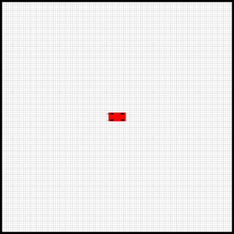
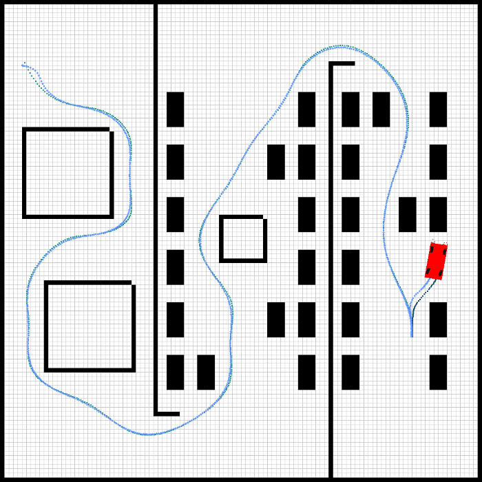

# Automatic Parallel Parking : Path Planning, Path Tracking & Control
This repository contains an automatic parallel parking system including path planning, path tracking, and parallel parking in a designed environment written in python.

run the code using this command:
```
$ python main_autopark.py --x_start 0 --y_start 90 --phi_start 0 --parking 7
```
you can choose the parking spot from 1 to 24:


# Abstract
In This Project, We Designed and Programmed an Automated Parking System With Its Implementation Environment. With the Help of This System, the Car Is Routed and Moved to the Designated Parking Place and the Park in It Is Completely Automatic. Algorithms Such As Path Planning, Path Tracking, A* Search Algorithm and High Coding Skills in Python Have Been Used
in This Project.

## Envroinment
Our first step to develop an auto park system was to design and develop an environment capable of giving visual render using ```OpenCV``` library.
Environment is implemented in ```environment.py``` as a class and recieves obstacles at the beginning ```env = Environment(obs)```.
Agent can be placed using ```env.render(x,y,angle)```.
A sample of environment is displayed bellow.


## Path Planning

#### A* Algorithm
The agent will find a path from start to its goal using A*.
This implementation of A* from [PythonRobotics](https://pythonrobotics.readthedocs.io/en/latest/modules/path_planning.html), considers parameters like obstacles and robot radius.

#### Interpolating Path With B-spline
After finding a path in a descrete 100\*100 space, the path is smoothed and scaled to 1000\*1000 space of environment using b-spline.
The result is a set of points to guide our agent!

## Path Tracking
**Kinematic model** of the car, is:
```math
x = vcos(ϕ)
y = vsin((ϕ)
v = a
ϕ = vtan(δ)L
```
**State vector** is:
```math
z=[x,y,v,ϕ]
```
x: x-position, y: y-position, v: velocity, φ: yaw angle

**Input vector** is:
```math
u=[a,δ]
```
a: accellation, δ: steering angle

The MPC controller controls vehicle speed and steering based on the model and car is directed through the path.

## Parallel Parking
This part consists of 4 rules that agent must choose one according to parking position.
At first the agent will find a path to park position then it will compute the arriving angle.
Based on the arriving angle, agent chooses a coordinate as ensure1.
After that, parking path is planned from ensure1 to ensure2 using 2 circle equations as mentioned below.
MPC controls the agent and car parks in ensure2 coordinate.



## About Us
We as Team Pandas won 1st place in the National Rahneshan competition 2020-2021 for autonomous vehicles. This contest has been one of the most competitive and challenging contests in the Rahneshan tournaments with more than 15 teams competing from top universities in Iran.

## Contact
Feel free to contact us via email or connect with us on linkedin.

- Amirhossein Heydarian ---  [Linkedin](https://www.linkedin.com/in/amirhosseinh77/), [Github](https://github.com/amirhosseinh77), [Email](mailto:amirhossein4633@gmail.com )
- Aida Mohammadshahi ---  [Linkedin](https://www.linkedin.com/in/aida-mohammadshahi-9845861b3/), [Github](https://github.com/aidamohammadshahi), [Email](mailto:aidamoshahi@gmail.com)
- Milad Soltany --- [Linkedin](https://www.linkedin.com/in/milad-soltany/), [Github](https://github.com/miladsoltany) , [Email](mailto:soltany.m.99@gmail.com)
- Abbas Omidi --- [Linkedin](https://www.linkedin.com/in/abbasomidi77/), [Github](https://github.com/abbasomidi77), [Email](mailto:abbasomidi77@gmail.com)
- Amirhossein Kazerooni ---  [Linkedin](https://www.linkedin.com/in/amirhossein477/), [Github](https://github.com/amirhossein-kz), [Email](mailto:Amirhossein477@gmail.com )

